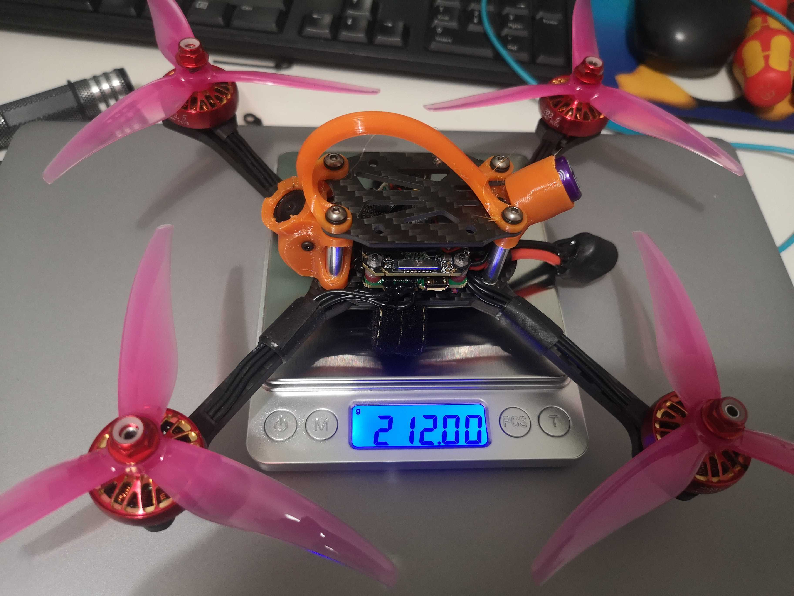

# Ultra light racing setup

Suitable for 20xx or 2203 motors (M2x12 4 hole mounting) and AIO boards (25.5x25.5 mounting).

# Notes

**No brace available at the moment!**

Other parts are the same as for 2020 frame and can be found from [here](../2020/dxf/).

Arms can be 4mm or 5mm thick.

# BOM

| count | type |
| --- | --- |
| 4 | [arm](dxf/fin_racer_whoop_arm_M2x12.dxf) |
| 1 | [middle plate](dxf/fin_racer_whoop_midplate_2mm.dxf) |
| 1 | [bottom plate](../2020/dxf/fin_racer_2020_bottom_2mm.dxf) |
| 1 | [top plate](../2020/dxf/fin_racer_2020_top_whoop_2mm.dxf) |
| 2 | [lock matching to arm thickness](../2020/dxf/fin_racer_2020_lock4_2mm.dxf) |

Note: you can use the [ middle plate](../2020/dxf/fin_racer_2020_middle_inserts_2mm.dxf) with 20x20 mounting
if you don't want to use whoop style stack.
