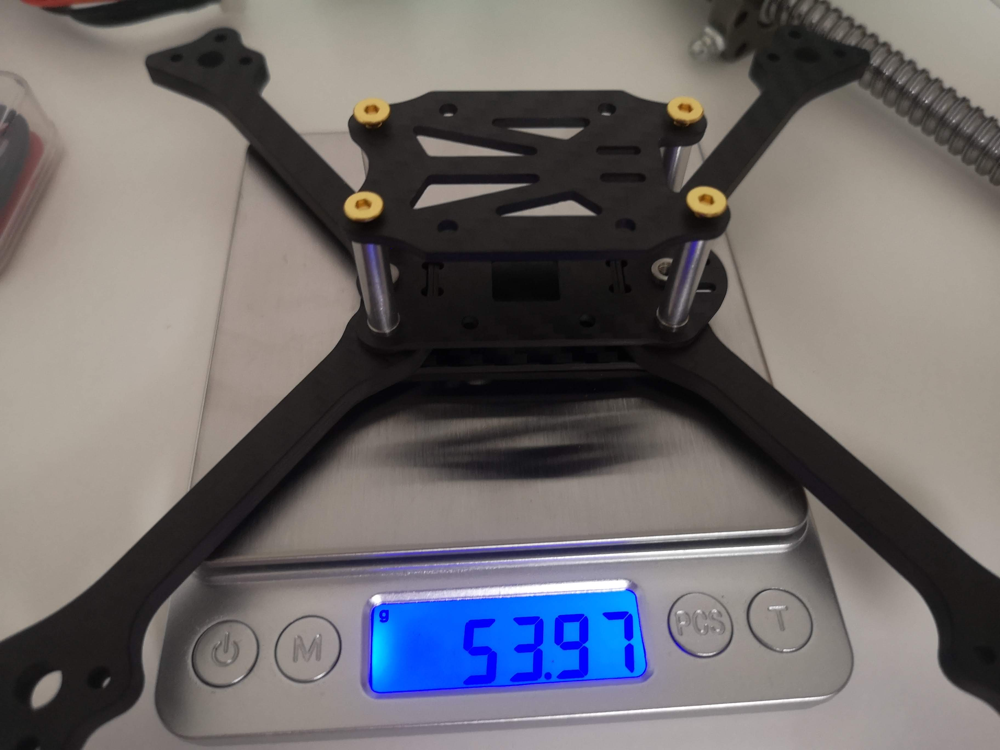
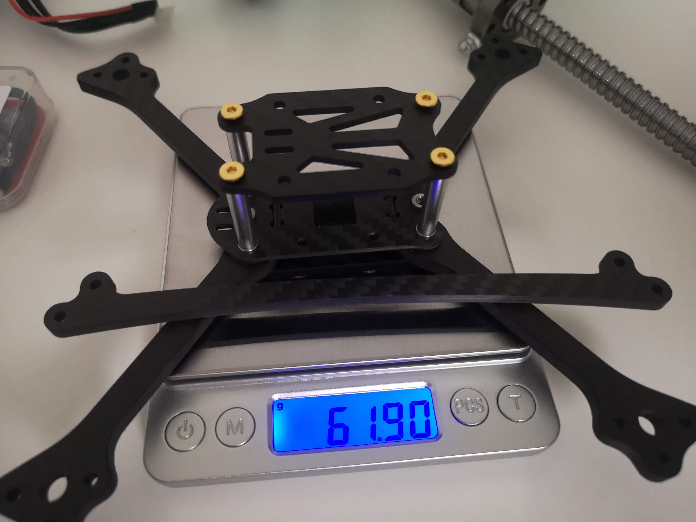

# FPV Finland Racing Frame

## Hardware

* 4pcs M3x20-25mm titan screws + aluminium M3 nyloc nuts (stack)
  * Screws: https://www.aliexpress.com/item/1005002946010479.html
    * 25mm is optimal for HDZero setup (ESC+FC+VTX) with 22mm standoffs
  * Nuts: https://www.aliexpress.com/item/1005003964260953.html
* 4pcs M3x18-20mm 12.9 steel screws (arms)
  * https://www.aliexpress.com/item/1005002542173277.html
* 2pcs M3x10mm titan screws (locks)
  * https://www.aliexpress.com/item/531983765.html
* 4pcs M3x8mm titan screws (top plate)
  * https://www.aliexpress.com/item/4000569037127.html
* 4pcs M3 20-22mm standoffs
  * https://www.aliexpress.com/item/4000152799825.html
